# 🚀 [Tips Hindawi](https://www.tipshindawi.com/) Challenge (June–July) 2026

> 🏆 This repository is my official submission for the [**Tips Hindawi**](https://www.tipshindawi.com/) **Challenge (June–July 2026)**.

## 👤 Participant

| Field            | Value                                |
| ---------------- | ------------------------------------ |
| Full Name        | **Amin Tarig Amin Abbas**                 |
| Project Name     | **SecureRepo AI**                    |
| GitHub Username  | **AminTariq**           |
| Challenge Batch  | June–July 2026                       |
| Training Program | Large Language Models (LLMs) Program |
| Organization     | [**Edrak for Ai**](https://edrak4ai.com/en) |

---

# 📖 Project Overview

**SecureRepo AI** is an AI-powered security reviewer for public Python GitHub repositories. It combines static analysis, RAG, and a fine-tuned open-source LLM to explain security findings and recommend fixes.

I saw security risks growing alongside vibe coding, so I wanted to solve the problem cleanly. I fine-tuned **Qwen3-4B-Instruct-2507** with Unsloth and QLoRA on **1,200 vulnerable and safe Python examples**, then uploaded my trained LoRA adapter to [**Hugging Face**](https://huggingface.co/AminTariq/securerepo-qwen3-4b-lora). I added FAISS RAG and Bandit in Kaggle, validated reports with Pydantic, exposed the backend through FastAPI and ngrok, and connected everything to a Streamlit frontend.

```text
GitHub URL → Bandit → RAG → Fine-tuned Qwen → Pydantic → Streamlit report
```

SecureRepo AI is designed as a practical first-pass review and learning tool, not a replacement for a professional security audit.

---

# ✨ Features

* Scans public Python GitHub repositories without executing their code
* Combines Bandit, RAG, and a fine-tuned open-source LLM
* Uses a LoRA adapter trained on 1,200 security examples
* Reports severity, confidence, CWE, OWASP, evidence, and suggested fixes
* Streams live scan progress from Kaggle to Streamlit
* Saves scan history and supports downloadable JSON reports

---

# 🛠️ Technologies Used

| Area | Technologies |
| ---- | ------------ |
| Model | Qwen3-4B-Instruct-2507, Unsloth, QLoRA, PEFT |
| Security | Bandit, CWE, OWASP |
| RAG | FAISS, LangChain, Sentence Transformers |
| Validation | Pydantic |
| Backend | Kaggle GPU, FastAPI, Uvicorn, ngrok |
| Frontend | Streamlit, Requests, SQLite |

---

# ⚙️ Installation

### 1. Start the Kaggle backend

1. Open `notebooks/SecureRepo_AI_Kaggle_Backend.ipynb` in Kaggle.
2. Enable a GPU and Internet access.
3. Add `NGROK_AUTHTOKEN` to Kaggle Secrets.
4. Run all nine notebook blocks.
5. Keep Kaggle running and copy the backend URL and API key printed by the final block.

### 2. Run the Streamlit frontend

Open PowerShell in the project folder:

```powershell
git clone https://github.com/AminTariq/SecureRepo-AI.git
cd SecureRepo-AI

python -m venv .venv
.\.venv\Scripts\Activate.ps1
python -m pip install -r requirements.txt
```

Copy `.streamlit/secrets.toml.example` to `.streamlit/secrets.toml` and add:

```toml
SECUREREPO_BACKEND_URL = "YOUR_KAGGLE_NGROK_URL"
SECUREREPO_API_KEY = "YOUR_SECUREREPO_API_KEY"
```

Then start the app:

```powershell
python -m streamlit run app.py
```

> Never upload `.streamlit/secrets.toml`, API keys, ngrok tokens, or active tunnel URLs to GitHub.

---

# 🚀 Usage

1. Keep the Kaggle notebook running.
2. Open the local Streamlit app.
3. Paste a public GitHub repository URL.
4. Select the number of Python files to review.
5. Start the scan and inspect the streamed security report.
6. Download the final report as JSON if needed.

---

# 📸 Demo

The screenshots below show the complete flow—from opening the workspace to reviewing a validated security report—using the public [Vulpy test repository](https://github.com/fportantier/vulpy).

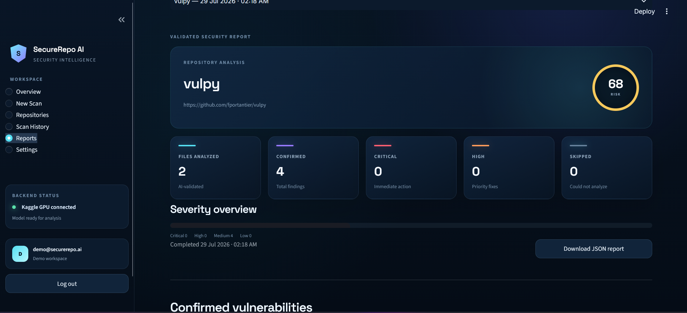

<p align="center"><sub>Validated repository report with a risk score, severity summary, confirmed findings, and downloadable JSON output.</sub></p>

<details>
<summary><strong>1. Access and workspace overview</strong></summary>
<br>

<table>
  <tr>
    <td align="center"><strong>Demo authentication</strong></td>
    <td align="center"><strong>Repository overview</strong></td>
  </tr>
  <tr>
    <td>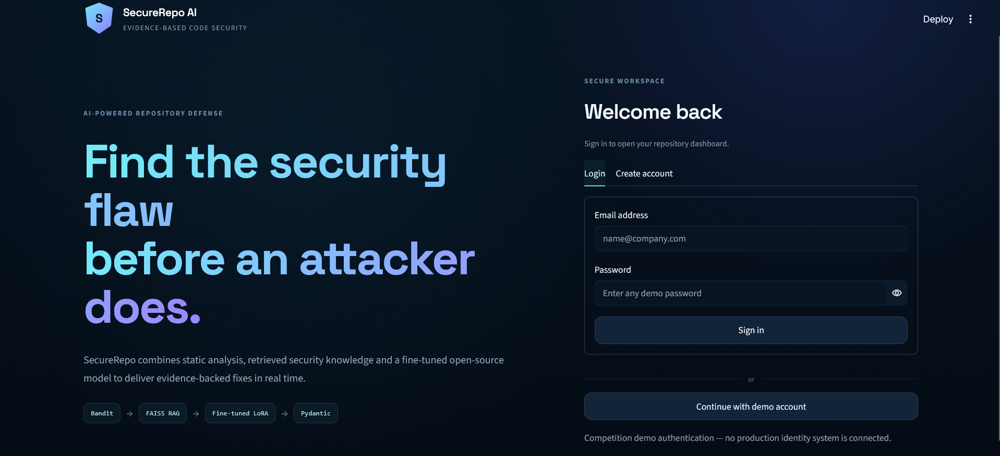</td>
    <td>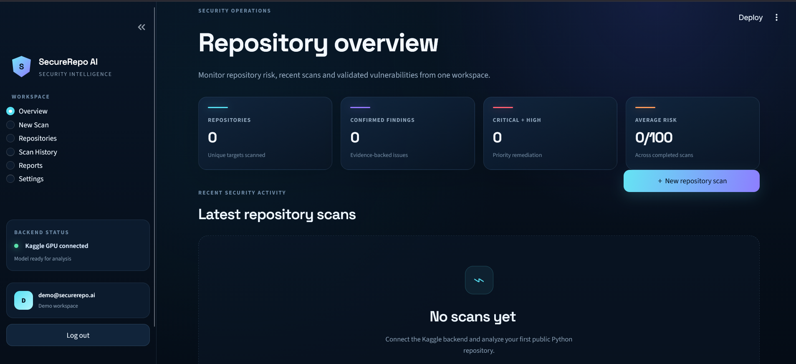</td>
  </tr>
</table>

</details>

<details>
<summary><strong>2. Repository scan and live AI analysis</strong></summary>
<br>

<table>
  <tr>
    <td align="center"><strong>Configure a public repository scan</strong></td>
    <td align="center"><strong>Stream vulnerability evidence</strong></td>
  </tr>
  <tr>
    <td>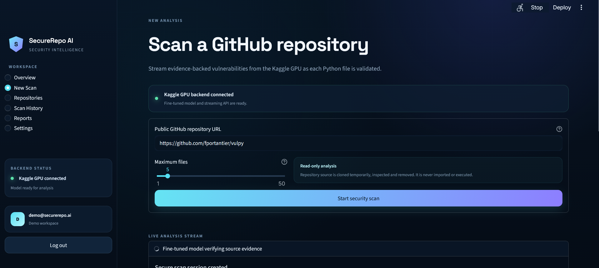</td>
    <td>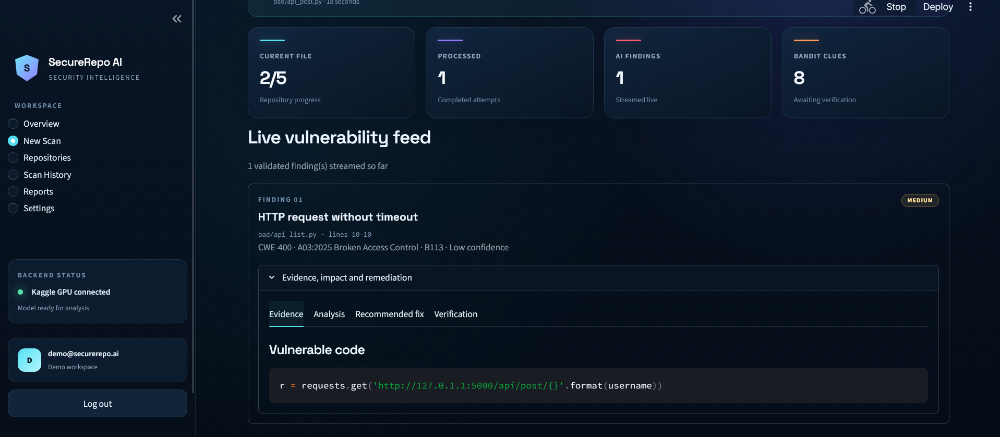</td>
  </tr>
  <tr>
    <td align="center"><strong>Understand the security impact</strong></td>
    <td align="center"><strong>Review the recommended fix</strong></td>
  </tr>
  <tr>
    <td>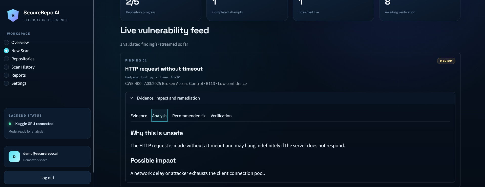</td>
    <td>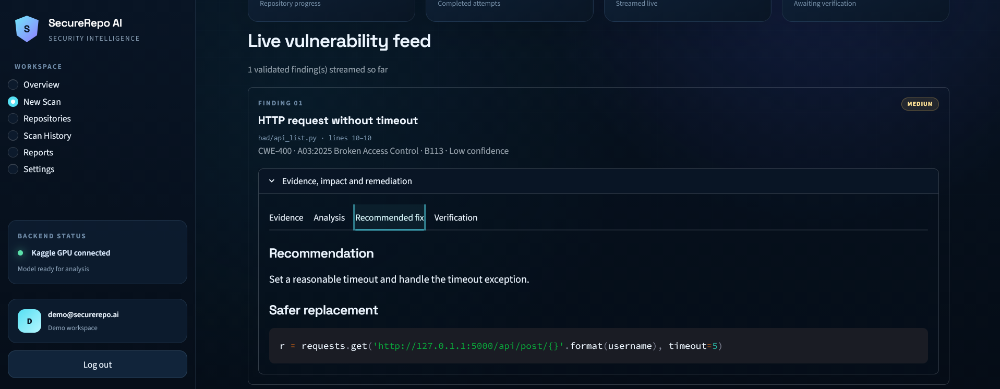</td>
  </tr>
  <tr>
    <td align="center"><strong>Verify the classification</strong></td>
    <td align="center"><strong>Inspect multiple findings</strong></td>
  </tr>
  <tr>
    <td>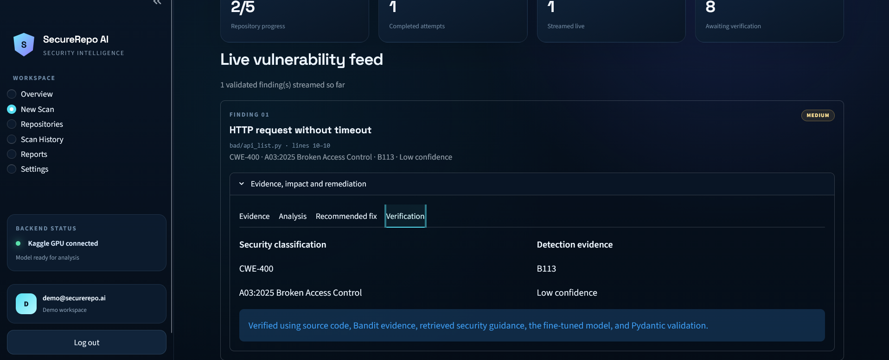</td>
    <td>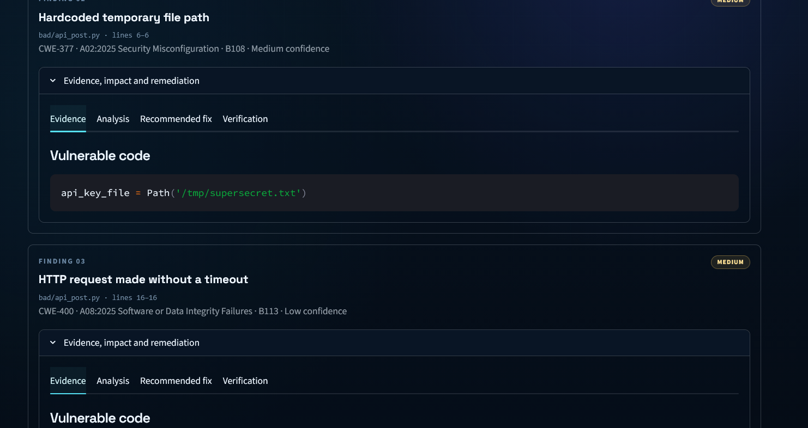</td>
  </tr>
</table>

</details>

<details>
<summary><strong>3. Repositories, history, and system status</strong></summary>
<br>

<table>
  <tr>
    <td align="center"><strong>Monitored repositories</strong></td>
    <td align="center"><strong>Persistent scan history</strong></td>
  </tr>
  <tr>
    <td>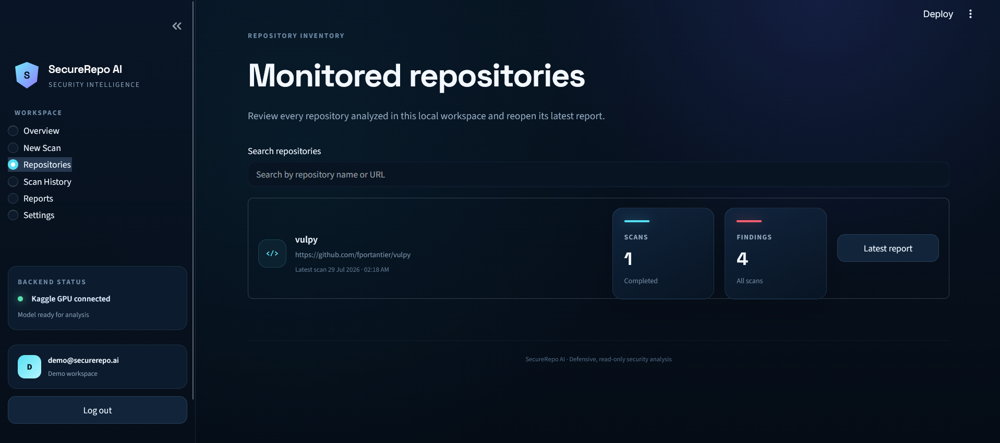</td>
    <td>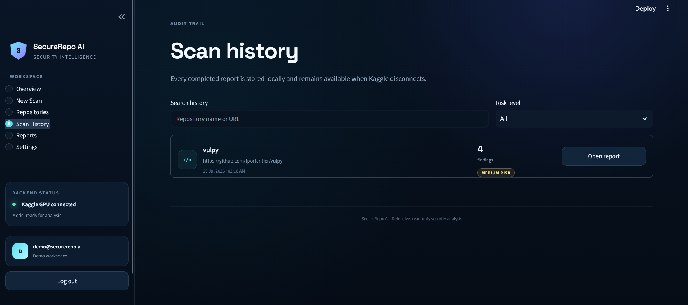</td>
  </tr>
  <tr>
    <td colspan="2" align="center"><strong>Kaggle backend and system status</strong></td>
  </tr>
  <tr>
    <td colspan="2">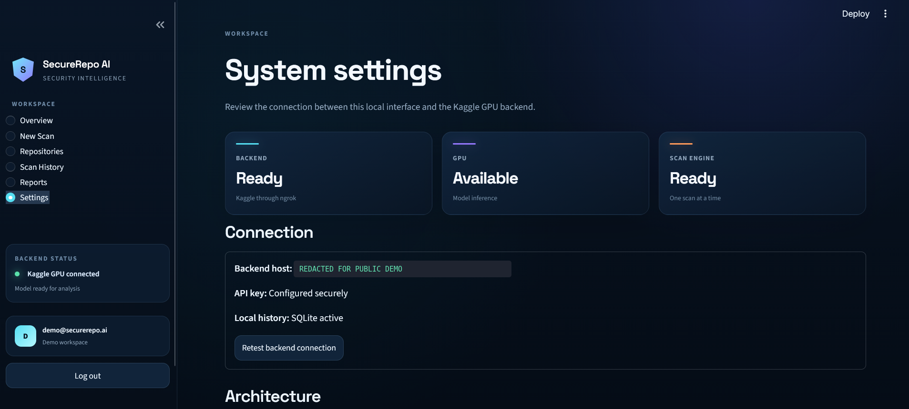</td>
  </tr>
</table>

</details>

---

# 📈 Results

SecureRepo AI delivers a working end-to-end prototype that scans selected Python files, combines static-analysis evidence with retrieved guidance, generates structured security findings, and streams the validated report to a local dashboard.

The project currently supports **public Python repositories**. A clean result means no supported issues were found in the analyzed files and code sections; it does not prove that the entire repository is secure.

---

# 🔮 Future Improvements

* Add support for more programming languages and private repositories
* Build a formal benchmark for accuracy and false-positive testing
* Deploy the backend permanently instead of using a temporary Kaggle/ngrok session

---

# 📚 About the Challenge

This project was developed as part of the [**Tips Hindawi**](https://www.tipshindawi.com/) **Challenge (June–July 2026)**.

[Tips Hindawi](https://www.tipshindawi.com/) is the internships department of [**Edrak for Ai**](https://edrak4ai.com/en), and the challenge encourages participants to build real-world projects, apply practical skills, and showcase their work through GitHub.

For more information about the challenge, training programs, and upcoming batches, visit the official [Tips Hindawi](https://www.tipshindawi.com/) website.

---

# 📄 License

This project is shared for educational and portfolio purposes.
