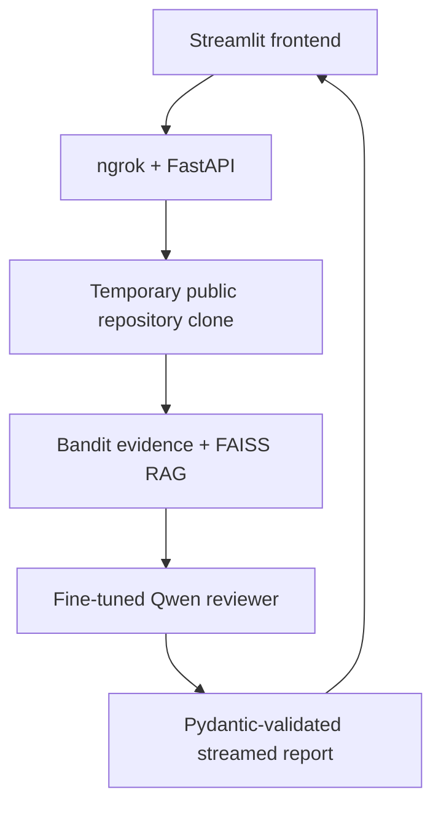

# SecureRepo AI

### An AI-powered security reviewer for public Python repositories

SecureRepo AI combines static analysis, retrieval-augmented generation, and a
fine-tuned open-source language model to turn a public GitHub repository into a
clear, structured security report.

> 🏆 This repository is my official submission for the
> [**Tips Hindawi**](https://www.tipshindawi.com/) **Challenge
> (June–July 2026)**.

## Participant

| Field | Value |
| --- | --- |
| Full Name | **Amin Tarig Amin Abbas** |
| Project Name | **SecureRepo AI** |
| GitHub Username | **AminTariq** |
| Challenge Batch | June–July 2026 |
| Training Program | Large Language Models (LLMs) Program |
| Organization | [**Edrak for Ai**](https://edrak4ai.com/en) |

## The Problem

Vibe coding has made software much faster to build, but speed can make security
easy to overlook. A generated application may work correctly while still
containing SQL injection, hardcoded secrets, unsafe deserialization, weak
cryptography, or other vulnerabilities that a new developer may not recognize.

Raw scanner warnings are also difficult for beginners to understand. Developers
need more than a warning code: they need evidence, a simple explanation of the
risk, and practical remediation guidance.

## Why I Built SecureRepo AI

Vibe coding has made it possible to turn an idea into a working application
faster than ever. While exploring this new way of building, I noticed a growing
problem: it is easy to focus on whether generated code works and overlook
whether it is secure.

That became the reason I built SecureRepo AI.

I wanted to create something more useful than a general chatbot that simply
looked at code and guessed. I first fine-tuned an open-source Qwen model with
Unsloth using **1,200 security-focused training examples**—800 vulnerable and
400 safe examples covering 20 vulnerability families. I then added a
FAISS-based RAG knowledge base, Bandit static-analysis evidence, and Pydantic
validation so the model's output would remain structured and useful.

Because the model requires GPU resources, I run the backend in Kaggle. FastAPI
turns the analysis workflow into a streaming API, ngrok connects the temporary
Kaggle backend to the local application, and Streamlit provides a simple
frontend where a user can submit a public GitHub repository and follow the
review as it happens.

SecureRepo AI is not intended to replace a professional security audit. It is a
practical first-pass review and learning tool designed to help developers find
supported issues earlier, understand why they matter, and learn how they can be
fixed.

## What SecureRepo AI Does

1. Accepts the URL of a public GitHub repository.
2. Clones the repository into a temporary Kaggle directory without executing
   its code.
3. Discovers supported Python files and runs Bandit static analysis.
4. Selects relevant source-code context and retrieves security guidance from a
   FAISS knowledge base.
5. Sends the code, scanner evidence, and retrieved guidance to the fine-tuned
   Qwen reviewer.
6. Validates the model response with Pydantic.
7. Streams progress and findings through FastAPI and ngrok.
8. Displays the final report in a Streamlit dashboard.

## Key Features

- Public GitHub repository scanning
- Hybrid **Bandit + RAG + fine-tuned LLM** analysis
- Fine-tuning with 1,200 structured Python-security training examples
- Coverage of 20 vulnerability families with vulnerable and safe examples
- Severity, confidence, CWE, and OWASP classification
- Evidence, impact, remediation, and safer-code guidance
- Pydantic-validated report structure
- Live NDJSON progress and finding updates
- Local scan history and downloadable JSON reports
- Read-only design: cloned repository code is never imported or executed

## How It Works



The Streamlit interface runs locally. The model, Bandit workflow, RAG database,
and FastAPI service run in the Kaggle notebook so they can use a GPU.

## Dataset and Fine-Tuning

The included training split contains **1,200 original synthetic examples**:

| Training label | Examples |
| --- | ---: |
| Vulnerable | 800 |
| Safe / no findings | 400 |
| **Total** | **1,200** |

The data covers 20 Python vulnerability families, including:

- SQL and command injection
- Dynamic code execution
- Hardcoded secrets
- Weak password hashing and insecure randomness
- Disabled TLS verification
- Unsafe YAML and object deserialization
- Path traversal and Zip Slip
- SSRF, XXE, and access-control issues
- Sensitive logging, debug mode, and unsafe permissions

Each example uses a chat-style `system → user → assistant` structure. Assistant
answers follow the same structured security-report schema used by the live
application.

| Item | Value |
| --- | --- |
| Base model | `unsloth/Qwen3-4B-Instruct-2507-bnb-4bit` |
| Fine-tuning | Unsloth with 4-bit QLoRA |
| Training split | `dataset/securerepo_train.jsonl` |
| LoRA adapter | `AminTariq/securerepo-qwen3-4b-lora` |
| Runtime | Kaggle GPU |

The included Kaggle notebook loads the trained LoRA adapter and runs the live
inference backend.

## Technologies Used

| Purpose | Technologies |
| --- | --- |
| Base model | Qwen3-4B Instruct |
| Fine-tuning | Unsloth, QLoRA, PEFT |
| Static analysis | Bandit |
| Retrieval | LangChain, Sentence Transformers, FAISS |
| Output validation | Pydantic |
| Backend | FastAPI, Uvicorn, NDJSON streaming |
| GPU runtime | Kaggle |
| Connectivity | ngrok |
| Frontend | Streamlit, Requests, SQLite |
| Source input | Public GitHub repositories |

## Repository Structure

```text
SecureRepo-AI/
├── README.md
├── app.py
├── styles.css
├── requirements.txt
├── .gitignore
├── .streamlit/
│   ├── config.toml
│   └── secrets.toml.example
├── notebooks/
│   └── SecureRepo_AI_Kaggle_Backend.ipynb
└── dataset/
    └── securerepo_train.jsonl
```

`dataset/` is intentionally separate from `data/`. The frontend creates
`data/securerepo.db` for local scan history, and that generated folder should
not be committed.

## Installation

### Prerequisites

- Python 3.10 or newer
- Git
- A Kaggle account with GPU and Internet access enabled
- An ngrok account and authentication token

### 1. Start the Kaggle backend

1. Upload and open `notebooks/SecureRepo_AI_Kaggle_Backend.ipynb` in Kaggle.
2. Enable a GPU accelerator and Internet access.
3. Add `NGROK_AUTHTOKEN` to Kaggle Secrets.
4. Run Blocks 1–9 from top to bottom.
5. Keep the notebook session running.
6. Copy the temporary backend URL and SecureRepo API key printed by Block 9.

### 2. Configure the local frontend

Clone this repository and open it:

```bash
git clone https://github.com/AminTariq/SecureRepo-AI.git
cd SecureRepo-AI
```

Create a virtual environment:

```bash
python -m venv .venv
```

Activate it on macOS or Linux:

```bash
source .venv/bin/activate
```

Or activate it on Windows PowerShell:

```powershell
.\.venv\Scripts\Activate.ps1
```

Install the frontend requirements:

```bash
python -m pip install -r requirements.txt
```

Copy `.streamlit/secrets.toml.example` to `.streamlit/secrets.toml`, then enter
the values printed by the Kaggle notebook:

```toml
SECUREREPO_BACKEND_URL = "https://your-current-ngrok-url.ngrok-free.app"
SECUREREPO_API_KEY = "your-current-private-api-key"
```

Never commit `.streamlit/secrets.toml`, an ngrok token, a live tunnel URL, or an
API key.

### 3. Run Streamlit

```bash
python -m streamlit run app.py
```

## Usage

1. Make sure the Kaggle notebook is still running.
2. Open the local Streamlit URL in your browser.
3. Enter any non-empty email and password to access the demonstration interface,
   or select the demo account.
4. Paste a public GitHub repository URL.
5. Choose how many Python files to review, from 1 to 50.
6. Start the scan and follow the live analysis feed.
7. Review the findings, evidence, explanations, and recommendations.
8. Download the completed report as JSON if required.

## Example Finding

```json
{
  "title": "SQL Injection",
  "cwe_id": "CWE-89",
  "severity": "high",
  "confidence": "high",
  "file": "app/database.py",
  "evidence": "cursor.execute(f\"SELECT * FROM users WHERE id = {user_id}\")",
  "recommendation": "Use a parameterized query instead of inserting input into SQL text."
}
```

Recommended demo flow:

1. Start with the dashboard and show that the Kaggle backend is ready.
2. Submit a deliberately vulnerable public test repository.
3. Show Bandit completion and live AI-review events.
4. Open one detailed vulnerability card.
5. Show the final severity summary and JSON download.

## Results

SecureRepo AI currently delivers a working end-to-end prototype that:

- connects a local Streamlit frontend to a Kaggle GPU backend;
- scans selected Python files from public GitHub repositories;
- combines static-analysis clues with retrieved security guidance;
- produces structured, validated file-level security reviews;
- streams progress and findings while the scan is running;
- handles safe, vulnerable, partial, and failed analyses without presenting an
  incomplete scan as proof that a repository is secure; and
- stores local report history and supports JSON export.

No accuracy percentage is claimed yet because the project has not completed a
formal benchmark against independently reviewed real-world repositories.

## Limitations and Responsible Use

- SecureRepo AI currently supports public repositories and Python source files.
- It reviews selected files and code sections; it does not prove that an entire
  repository is secure.
- Large files, unsupported files, and files beyond the selected limit may not
  be reviewed.
- AI-assisted findings may include false positives or false negatives.
- The Kaggle runtime and ngrok URL are temporary and must remain active during a
  scan.
- The tool is intended for defensive education and early review, not as a
  replacement for penetration testing or a professional security audit.

A clean result should be interpreted as:

> No supported findings were found in the analyzed files and code sections.

## Future Improvements

- Add an independently reviewed evaluation benchmark and report precision,
  recall, and false-positive rates
- Support additional programming languages and repository types
- Add dependency, secret, and software-composition scanners
- Improve repository-wide data-flow and cross-file analysis
- Add persistent cloud deployment instead of a temporary Kaggle tunnel
- Add GitHub pull-request and CI/CD integration
- Expand the RAG knowledge base with maintained OWASP, CWE, and framework
  security guidance

## About the Challenge

This project was developed as part of the
[**Tips Hindawi**](https://www.tipshindawi.com/) **Challenge
(June–July 2026)**.

[Tips Hindawi](https://www.tipshindawi.com/) is the internships department of
[**Edrak for Ai**](https://edrak4ai.com/en). The challenge encourages
participants to build real-world projects, apply practical skills, and showcase
their work through GitHub.

For more information about the challenge, training programs, and upcoming
batches, visit the official
[Tips Hindawi](https://www.tipshindawi.com/) website.

## Acknowledgements

Thanks to Tips Hindawi and Edrak for Ai for the training and challenge. This
project also uses open-source work from Qwen, Unsloth, Bandit, LangChain,
Sentence Transformers, FAISS, Pydantic, FastAPI, Streamlit, OWASP, and CWE.

## Usage Notice

This project is shared for educational, research, competition, and portfolio
purposes. Review all AI-generated security advice before applying it to
production software.
